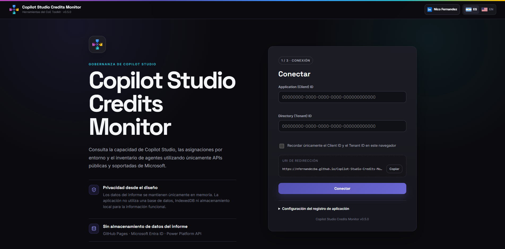
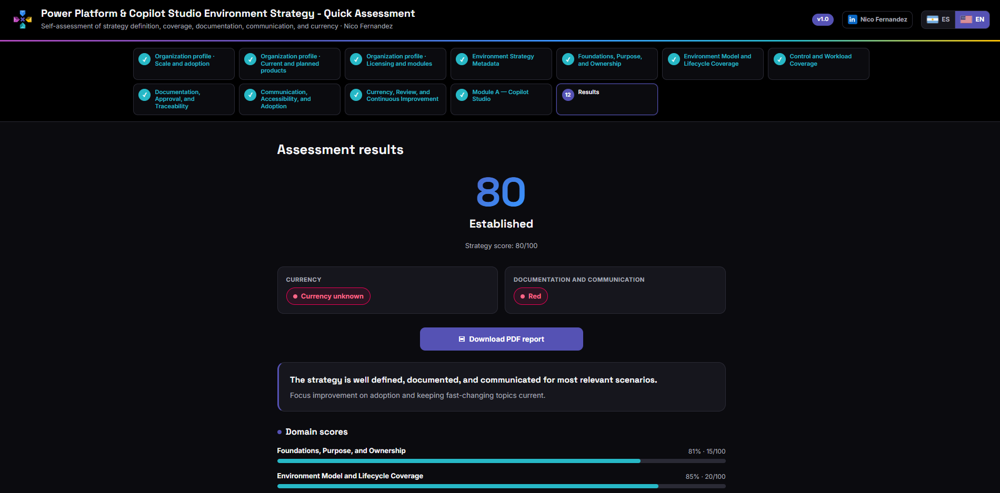
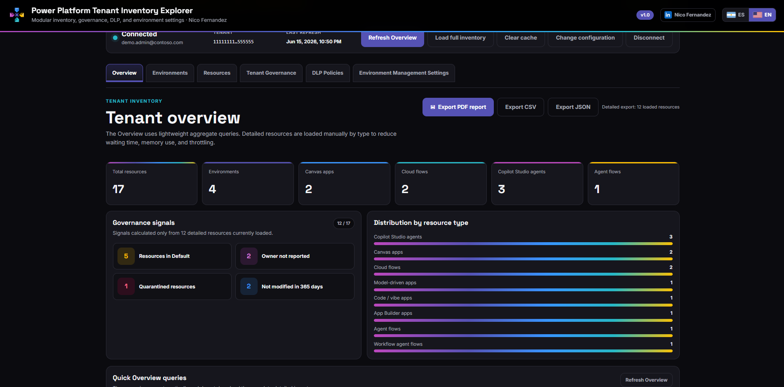
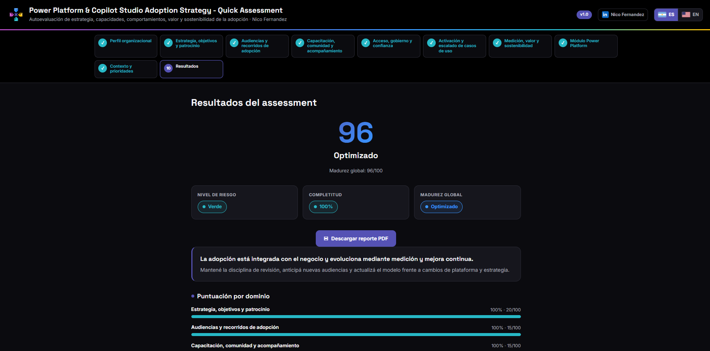

# Agent Passport


A browser-based tool for designing, documenting, reviewing, and governing enterprise agents throughout their lifecycle. Agent Passport provides a structured record for purpose, value, governance zones, risk, knowledge, data, actions, integrations, ownership, assurance, observability, and lifecycle decisions, with local PDF and JSON export and no backend required.

**Public version: 1.0**

[Español](#español) · [English](#english)

---

## About this project

**Agent Passport** is a community-oriented governance tool designed to turn an initial agent idea into a structured and maintainable lifecycle record.

The passport begins during ideation and evolves as the agent moves through prototype, pilot, production, business-critical operation, and retirement. It helps organizations capture not only what the agent is expected to do, but also why it should exist, which knowledge and systems it uses, what actions it may perform, who is accountable for it, which controls apply, and how quality, risk, cost, and operational health will be monitored.

The tool is intentionally lightweight. It runs directly in a modern browser, does not require authentication, does not connect to a Microsoft tenant, and can be published as a static website. It is suitable for discovery workshops, solution-definition activities, governance reviews, architecture discussions, pilot-readiness assessments, production approvals, and periodic lifecycle reviews.

### What Agent Passport provides

The tool supports:

- agent identity, purpose, business problem, intended outcomes, audience, use cases, and exclusions;
- Microsoft governance-zone classification and the independent **Z1, Z2, Z3, and Z3+** book framework;
- data sensitivity, autonomy, action capability, business impact, criticality, and risk classification;
- repeatable knowledge-source records with source-specific owners, verification details, access models, and refresh responsibilities;
- repeatable action and integration records with permissions, approval requirements, boundaries, dependencies, and rollback information;
- role and accountability records covering business, product, technical, architecture, security, privacy, compliance, Responsible AI, operations, support, and CoE oversight;
- KPIs, monitoring, audit, transcripts, cost controls, alerting, incident response, lifecycle promotion, and retirement criteria;
- visually grouped compound reviews for risk, architecture, security, privacy, compliance, Responsible AI, least privilege, and production readiness;
- a consolidated passport summary and completeness indicator;
- local JSON export and import;
- a downloadable executive PDF report.

### Compound controls and repeatable records

Agent Passport does not model every answer as an isolated question.

Related fields such as status, reviewer, review date, validity, next review, conditions, and evidence are presented as one compound review component. This makes the form easier to understand while preserving the underlying structure required for governance and auditability.

Information that can occur multiple times is stored as repeatable records rather than parallel lists. For example, every knowledge source contains its own owner assignments, verification date, sensitivity, access model, retrieval method, refresh frequency, and status. This prevents relationships such as `source + source owner` from becoming inconsistent.

Stable identifiers are generated for repeatable entities:

| Entity | Identifier pattern | Example |
|---|---|---|
| Knowledge source | `KS-NNN` | `KS-001` |
| Action | `AC-NNN` | `AC-001` |
| Integration dependency | `DEP-NNN` | `DEP-001` |
| KPI | `KPI-NNN` | `KPI-001` |

### Downloadable PDF report

The summary page includes an option to generate an executive PDF report directly in the browser.

The report is designed to support:

- agent ideation and discovery workshops;
- governance and architecture reviews;
- security, privacy, compliance, and Responsible AI discussions;
- pilot and production-readiness decisions;
- portfolio and steering-committee conversations;
- ownership and support handover;
- lifecycle reassessment and retirement planning.

Depending on the information entered, the PDF includes the agent identity, purpose, governance-zone classifications, risk profile, knowledge sources, actions, integrations, ownership, KPIs, lifecycle status, review outcomes, related books, CoE Toolkit resources, and the author’s LinkedIn profile.

### JSON portability

The complete passport can be exported as a structured JSON file and imported later to continue editing.

The export uses the following schema metadata:

```json
{
  "meta": {
    "schema": "agent-passport",
    "version": "1.0",
    "createdOn": "YYYY-MM-DD",
    "modifiedOn": "YYYY-MM-DD",
    "exportedOn": "ISO-8601",
    "language": "en"
  }
}
```

The JSON export is intended for portability and continuity. It is not an encrypted storage format and should be handled according to the sensitivity of the information entered.

### Privacy by design

Agent Passport processes the passport information locally in the browser.

It does **not** require:

- a user account;
- Microsoft Entra authentication;
- a Microsoft tenant connection;
- a backend service;
- a database;
- automatic submission of passport data to the author.

The application does not automatically persist the passport. The selected interface language may be retained locally, but the passport itself should be exported as JSON when the user needs to save or transfer it.

External requests used to load fonts, the PDF library, book covers, or linked resources do not include the passport answers.

> Agent Passport is a documentation and governance aid. It does not replace formal security, privacy, legal, compliance, Responsible AI, architecture, testing, risk-acceptance, or production-approval processes.

---

# Español

## Descripción

**Agent Passport** es una herramienta web destinada a idear, documentar, revisar y gobernar agentes empresariales durante todo su ciclo de vida.

El pasaporte transforma una idea inicial en un registro de gobierno estructurado y progresivo. Permite documentar el propósito del agente, el problema de negocio, el valor esperado, la audiencia, los casos de uso, el perfil de riesgo, las fuentes de conocimiento, los datos procesados, las acciones permitidas, las integraciones, las responsabilidades, las revisiones formales, la observabilidad y los criterios de evolución o retiro.

La herramienta está orientada a:

- responsables de negocio y product owners;
- makers y equipos de desarrollo;
- líderes y miembros de Centros de Excelencia;
- arquitectos de soluciones y enterprise architects;
- responsables de Power Platform y Copilot Studio;
- equipos de seguridad, privacidad, compliance y Responsible AI;
- responsables de operaciones, soporte y gestión de servicios;
- sponsors, comités de gobierno y responsables de riesgo.

Agent Passport no inspecciona automáticamente el tenant ni aprueba un agente. Su función es proporcionar una estructura común para documentar decisiones, identificar información pendiente y mantener trazabilidad a medida que el agente incrementa su alcance, audiencia, acceso a datos, capacidad de acción o autonomía.

## Objetivo

El objetivo principal es ayudar a una organización a responder una pregunta concreta:

> ¿Contamos con información suficiente, consistente y trazable para diseñar, evaluar, aprobar, operar y retirar este agente de manera responsable?

Para responderla, el pasaporte separa dimensiones que no deberían confundirse:

- **Propósito y valor:** por qué existe el agente y qué resultado debe producir.
- **Gobierno y riesgo:** qué clasificación, controles y decisiones de aceptación de riesgo aplican.
- **Conocimiento y datos:** qué fuentes utiliza, quién responde por ellas y cómo se mantienen.
- **Acciones y autonomía:** qué puede hacer el agente, bajo qué identidad y dentro de qué límites.
- **Ownership y accountability:** quién decide, construye, revisa, opera y responde ante incidentes.
- **Assurance:** qué revisiones, pruebas y evidencias son necesarias.
- **Observabilidad y sostenibilidad:** cómo se controlan calidad, uso, coste, degradación y soporte.
- **Ciclo de vida:** qué condiciones permiten promover, restringir, retirar o desmantelar el agente.

## Cómo funciona

El usuario recorre un flujo guiado organizado en ocho etapas:

1. **Identidad y propósito**
2. **Gobierno y riesgo**
3. **Conocimiento y datos**
4. **Acciones e integraciones**
5. **Ownership y accountability**
6. **Observabilidad y ciclo de vida**
7. **Revisiones y aprobaciones**
8. **Resumen del pasaporte**

La información se introduce mediante cuatro patrones principales:

### Campos simples

Se utilizan para respuestas atómicas como nombre del agente, identificador, propósito, audiencia o etapa del ciclo de vida.

### Bloques compuestos

Agrupan visualmente atributos relacionados. Por ejemplo, una revisión de seguridad contiene estado, reviewer, rol, fecha, validez, próxima revisión, condiciones, evidencia y comentarios, pero se presenta como una sola unidad de gobierno.

### Registros repetibles

Permiten agregar tantas fuentes, acciones, integraciones, KPIs u owners como sean necesarios. Cada registro mantiene sus propios atributos y relaciones.

### Referencias consistentes

Los elementos repetibles reciben un identificador estable. Esto permite relacionar una fuente, acción o integración con otros controles sin depender de listas paralelas o del orden visual de los elementos.

## Estructura del pasaporte

### 1. Identidad y propósito

Registra, entre otros elementos:

- nombre e ID del agente;
- tipo de agente y plataforma de construcción;
- propósito en un statement;
- problema y oportunidad de negocio;
- outcome esperado;
- caso de uso principal y casos secundarios;
- escenarios fuera de alcance y usos prohibidos;
- audiencia y volumen esperado;
- criterios de éxito y KPIs;
- business owner, sponsor y executive sponsor cuando corresponda;
- fechas de creación y modificación.

### 2. Gobierno y riesgo

Incluye:

- Governance Zone según Microsoft;
- Governance Zone según el marco del libro;
- sensibilidad de los datos;
- alcance de la audiencia;
- nivel de acciones;
- nivel de autonomía;
- impacto de una falla;
- criticidad de negocio;
- riesgo inherente y residual;
- canales de exposición;
- regulaciones y políticas aplicables;
- fechas y ownership de la evaluación de riesgo.

### 3. Conocimiento y datos

Permite mantener un registro por cada fuente de conocimiento con:

- ID, nombre, tipo y ubicación;
- propósito y contenido cubierto;
- uno o varios owners o custodians;
- sensibilidad;
- modelo de acceso y autenticación;
- método de recuperación o grounding;
- fecha y responsable de la última verificación;
- frecuencia de actualización;
- responsabilidad de mantenimiento;
- umbral de obsolescencia;
- estado y limitaciones conocidas.

También documenta residencia, retención, eliminación, consentimiento, minimización, datos personales, datos regulados y otras reglas de tratamiento.

### 4. Acciones e integraciones

Cada acción puede documentar:

- operación permitida;
- sistema conectado;
- trigger;
- identidad de ejecución;
- permisos;
- datos afectados;
- aprobación requerida;
- límites y restricciones;
- validaciones;
- riesgo;
- auditoría;
- manejo de errores;
- rollback o transacción compensatoria;
- owner.

Las integraciones se registran como dependencias independientes con su propósito, interface, modelo de identidad, permisos, criticidad, comportamiento ante fallas y contacto de soporte.

### 5. Ownership y accountability

La sección cubre roles como:

- business owner;
- product o service owner;
- knowledge owners;
- maker o builder;
- technical owner;
- IT y arquitectura;
- seguridad;
- privacidad y compliance;
- Responsible AI;
- operaciones y soporte;
- CoE lead;
- executive sponsor;
- responsables de escalación y aceptación de riesgo.

### 6. Observabilidad y ciclo de vida

Incluye:

- enfoque de monitoreo;
- KPIs y señales de calidad;
- transcripciones y retención;
- audit trail;
- dashboards de uso, calidad, seguridad y costes;
- consumo y capacidad;
- señales de degradación silenciosa;
- thresholds y alertas;
- incident response;
- etapa del ciclo de vida;
- criterios de promoción;
- criterios de restricción y retiro;
- plan de decommissioning.

### 7. Revisiones y aprobaciones

La versión actual incluye bloques compuestos para:

- evaluación de riesgo;
- revisión de arquitectura;
- revisión de seguridad;
- revisión de privacidad;
- validación de compliance;
- revisión de Responsible AI;
- validación de mínimo privilegio;
- production readiness y go-live.

Cada bloque utiliza estados controlados como:

- no requerido;
- no iniciado;
- en curso;
- enviado a revisión;
- aprobado;
- aprobado con condiciones;
- rechazado;
- vencido.

### 8. Resumen

La última etapa presenta:

- porcentaje orientativo de completitud;
- nombre e ID del agente;
- zona del libro;
- zona Microsoft;
- etapa del ciclo de vida;
- sensibilidad y autonomía;
- cantidad de fuentes, acciones y KPIs;
- propósito y outcome esperado;
- estado consolidado de las revisiones;
- acceso a exportación PDF, exportación JSON y LinkedIn;
- libros y herramientas relacionadas.

## Modelo de zonas

Agent Passport registra dos clasificaciones independientes.

### Governance Zone según Microsoft

Permite documentar la zona Microsoft aplicable al agente dentro del modelo de gobierno adoptado por la organización.

### Governance Zone según el libro

El marco del libro utiliza exclusivamente:

- **Z1**
- **Z2**
- **Z3**
- **Z3+**

La herramienta no presupone que ambas clasificaciones sean equivalentes. Cada una dispone de su propia justificación, responsable, fecha de asignación y próxima reevaluación.

## Registros repetibles y consistencia

Las listas paralelas no son suficientes cuando los elementos tienen atributos propios.

Por ejemplo, no se almacena una lista de fuentes y otra lista separada de owners. Cada fuente contiene uno o varios owner assignments. De esta forma, el owner, la función, el contacto, la fecha de verificación, la sensibilidad y el método de acceso permanecen asociados a la fuente correcta.

| Entidad | Patrón | Ejemplo |
|---|---|---|
| Fuente de conocimiento | `KS-NNN` | `KS-001` |
| Acción | `AC-NNN` | `AC-001` |
| Integración | `DEP-NNN` | `DEP-001` |
| KPI | `KPI-NNN` | `KPI-001` |

## Qué recibe el usuario

Al completar el pasaporte, el usuario dispone de:

- un registro estructurado del agente;
- una vista consolidada de gobierno;
- un indicador de completitud;
- tablas de fuentes, acciones, integraciones, KPIs y revisiones;
- un reporte PDF ejecutivo;
- un archivo JSON reutilizable;
- un mensaje preparado para compartir la herramienta en LinkedIn;
- enlaces a libros y herramientas complementarias del CoE Toolkit.

## Reporte PDF

El PDF se genera localmente mediante **jsPDF 2.5.1**.

El reporte utiliza una estructura visual coherente con la aplicación e incluye, cuando existe información disponible:

- portada ejecutiva;
- nombre e identificador del agente;
- propósito;
- zona del libro y zona Microsoft;
- etapa del ciclo de vida;
- identidad y contexto de negocio;
- perfil de gobierno y riesgo;
- fuentes de conocimiento;
- acciones e integraciones;
- ownership;
- observabilidad y KPIs;
- estado de revisiones y aprobaciones;
- recursos relacionados;
- perfil de LinkedIn del autor.

El nombre del archivo sigue un patrón similar a:

```text
Agent-Passport-<nombre-o-id>-<fecha>.pdf
```

La generación y descarga del PDF no implica el envío de las respuestas a un servidor.

## Exportación e importación JSON

La exportación JSON permite conservar y continuar el pasaporte.

El archivo contiene:

```text
meta
identity
governance
knowledgeSources[]
data
actions[]
integrations[]
ownership
kpis[]
observability
lifecycle
reviews
```

Durante la importación, la aplicación valida que el esquema sea:

```text
agent-passport / 1.0
```

El JSON no cifra la información. Debe almacenarse y compartirse de acuerdo con la sensibilidad del contenido documentado.

## Privacidad y tratamiento de datos

La solución procesa la información localmente en el navegador.

No requiere:

- login;
- conexión con Microsoft Entra;
- acceso al tenant;
- backend;
- base de datos;
- envío del pasaporte al autor.

El pasaporte no se guarda automáticamente. Para conservar el trabajo debe utilizarse **Exportar JSON**.

No deben incluirse secretos, contraseñas, tokens, certificados, connection strings ni credenciales. Cuando el pasaporte deba contener información confidencial o regulada, el archivo exportado debe almacenarse en un repositorio corporativo autorizado y protegido.

## Qué no hace la herramienta

Agent Passport no:

- inspecciona automáticamente agentes o entornos;
- valida la configuración real del tenant;
- comprueba permisos o DLP de forma automática;
- realiza pruebas de seguridad;
- ejecuta evaluaciones de Responsible AI;
- calcula riesgo de manera automática;
- concede una aprobación de producción;
- reemplaza evidencia formal;
- ofrece almacenamiento empresarial;
- permite colaboración simultánea en esta versión.

## Arquitectura técnica

La solución se distribuye como una SPA estática cuyo punto de entrada es:

```text
index.html
```

Los favicons y las imágenes utilizadas por el README se organizan en la carpeta `assets`.

El archivo incluye:

- HTML semántico;
- CSS responsive y mobile-first;
- componentes SVG embebidos;
- contenido de interfaz;
- estado de la aplicación en JavaScript;
- componentes de campos simples, bloques compuestos y registros repetibles;
- importación y exportación JSON;
- generación de PDF;
- enlaces a LinkedIn, libros y herramientas relacionadas;
- capturas visuales de las herramientas adicionales del CoE Toolkit.

No utiliza frameworks de frontend, gestores de paquetes ni procesos de build.

### Estructura recomendada del repositorio

```text
/
├── index.html
├── README.md
├── .nojekyll
├── assets/
│   ├── icons/
│   └── images/
│       └── tools/
└── docs/
    └── DEPLOYMENT.md
```

Los resultados de pruebas, sumas SHA-256 y listados de archivos no son necesarios para ejecutar la aplicación y pueden mantenerse fuera de la rama de publicación.

## Dependencias externas

| Dependencia | Uso |
|---|---|
| jsPDF 2.5.1 | Generación local del reporte PDF |
| Amazon Images | Portadas de libros |

Para una implementación completamente aislada, estas dependencias pueden alojarse localmente y actualizarse las referencias del HTML.

## Uso local

### Abrir directamente

1. Descargá `index.html`.
2. Abrilo con un navegador moderno.
3. Elegí **Crear pasaporte** o **Importar JSON**.
4. Completá las etapas aplicables.
5. Exportá el resultado en PDF o JSON.

### Ejecutar con un servidor local

Con Python:

```bash
python -m http.server 8000
```

Luego abrí:

```text
http://localhost:8000/
```

Con Node.js:

```bash
npx serve .
```

## Publicación en GitHub Pages

1. Creá un repositorio.
2. Copiá `index.html`, `README.md`, `.nojekyll` y la carpeta `assets` en la raíz.
3. Abrí **Settings > Pages**.
4. Seleccioná **Deploy from a branch**.
5. Elegí la rama `main` y la carpeta `/ (root)`.
6. Guardá la configuración.

La aplicación no utiliza MSAL, redirect URI ni APIs protegidas en esta versión.

## Personalización

### Contenido de interfaz

Los textos se definen en el objeto:

```javascript
const CONTENT = {
  es: {},
  en: {}
};
```

### Listas controladas

Las opciones reutilizables se mantienen en:

```javascript
const OPTION_SETS = {};
```

### Tipos de revisión

Los bloques compuestos se generan desde:

```javascript
const REVIEW_TYPES = [];
```

### Libros

Las ediciones mostradas se configuran en:

```javascript
const BOOKS = {
  es: [],
  en: []
};
```

### Herramientas adicionales

Las herramientas del CoE Toolkit se configuran en:

```javascript
const TOOLS = [];
```

### LinkedIn

El perfil del autor se define en:

```javascript
const LINKEDIN = "https://www.linkedin.com/in/nfernandezba";
```

## Libros relacionados

### Español

- [Definiendo la estructura marco para el Centro de Excelencia de Power Platform](https://www.amazon.com/-/es/Definiendo-estructura-Centro-Excelencia-Platform/dp/B0FSDWQMHW/ref=tmm_pap_swatch_0)
- [Copilot Studio y el futuro del Centro de Excelencia de Power Platform](https://www.amazon.com/-/es/Nicol%C3%A1s-Andr%C3%A9s-Fern%C3%A1ndez/dp/B0GZGL3T1K/ref=tmm_pap_swatch_0)

### English

- [Defining the Framework Structure for the Power Platform Center of Excellence](https://www.amazon.com/-/es/Defining-Framework-Structure-Platform-Excellence/dp/B0GDDRCD2C/ref=tmm_pap_swatch_0)
- [Copilot Studio and the Future of the Power Platform Center of Excellence](https://www.amazon.com/-/es/Nicol%C3%A1s-Andr%C3%A9s-Fern%C3%A1ndez/dp/B0H2VTJZGR/ref=tmm_pap_swatch_0)

## Otras herramientas del CoE Toolkit

Agent Passport presenta estas herramientas en un carrusel visual que muestra dos tarjetas por vez. Cada tarjeta incluye una captura, una descripción breve y, cuando la herramienta ya está publicada, un enlace directo.

<table>
<tr>
<td width="50%" valign="top">
<a href="https://nfernandezba.github.io/Copilot-Studio-Credits-Monitor/"></a>

### Copilot Studio Credits Monitor

Consultá la capacidad comprada, asignada y consumida, las asignaciones por entorno y el inventario de agentes mediante APIs públicas y soportadas de Microsoft.

[Open Copilot Studio Credits Monitor](https://nfernandezba.github.io/Copilot-Studio-Credits-Monitor/)
</td>
<td width="50%" valign="top">
<a href="https://nfernandezba.github.io/Power-Platform-Copilot-Studio-Environment-Assessment/"></a>

### Environment Strategy Quick Assessment

Evaluá la definición, cobertura, documentación, comunicación y vigencia de la estrategia de entornos de Power Platform y Copilot Studio.

[Open Environment Strategy Quick Assessment](https://nfernandezba.github.io/Power-Platform-Copilot-Studio-Environment-Assessment/)
</td>
</tr>
<tr>
<td width="50%" valign="top">
<a href="https://nfernandezba.github.io/power-platform-tenant-inventory-explorer/"></a>

### Power Platform Tenant Inventory Explorer

Explorá de forma read-only el inventario del tenant, los entornos, recursos, políticas DLP y configuraciones de gobierno.

[Open Power Platform Tenant Inventory Explorer](https://nfernandezba.github.io/power-platform-tenant-inventory-explorer/)
</td>
<td width="50%" valign="top">
<a href="https://nfernandezba.github.io/Power-Platform-Copilot-Studio-Adoption-Strategy-Assessment/"></a>

### Adoption Strategy Quick Assessment

Evaluá la estrategia, las capacidades, los comportamientos, el valor y la sostenibilidad de la adopción de Power Platform y Copilot Studio.

[Open Adoption Strategy Quick Assessment](https://nfernandezba.github.io/Power-Platform-Copilot-Studio-Adoption-Strategy-Assessment/)
</td>
</tr>
</table>

## Autor

**Nico Fernandez**

[](https://www.linkedin.com/in/nfernandezba)

## Marcas registradas

Microsoft, Power Platform, Copilot Studio, Microsoft 365, Microsoft Entra, Dataverse, Power Apps, Power Automate, Power BI, Power Pages, SharePoint and related product names are trademarks of the Microsoft group of companies.

Este proyecto es un recurso independiente creado para la comunidad. No está afiliado, patrocinado, certificado ni respaldado por Microsoft.

## Disclaimer

Agent Passport es una herramienta orientativa de documentación y gobierno.

No constituye:

- una certificación de Microsoft;
- una aprobación de producción;
- una auditoría de cumplimiento;
- una evaluación de seguridad;
- una evaluación formal de privacidad o DPIA;
- una evaluación de Responsible AI;
- asesoramiento legal o regulatorio;
- una garantía sobre el comportamiento del agente;
- un sustituto de testing, monitoreo, soporte o gestión de incidentes.

La organización es responsable de adaptar el pasaporte a sus políticas, riesgos, procesos y obligaciones regulatorias, y de validar la exactitud de la información documentada.

---

# English

## Overview

**Agent Passport** is a browser-based tool for designing, documenting, reviewing, and governing enterprise agents throughout their lifecycle.

It transforms an early agent concept into a structured, progressive governance record. The passport captures the agent’s purpose, business problem, expected value, audience, use cases, risk profile, knowledge, data, actions, integrations, responsibilities, formal reviews, observability, and lifecycle decisions.

The tool is intended for:

- business owners and product owners;
- makers and engineering teams;
- Center of Excellence leaders and members;
- solution architects and enterprise architects;
- Power Platform and Copilot Studio platform owners;
- security, privacy, compliance, and Responsible AI teams;
- operations, support, and service-management teams;
- sponsors, governance boards, and risk owners.

Agent Passport does not automatically inspect a tenant or approve an agent. It provides a common structure for documenting decisions, identifying missing information, and maintaining traceability as the agent expands its audience, data access, action capability, channel exposure, or autonomy.

## Objective

The main objective is to help an organization answer a practical question:

> Do we have sufficient, consistent, and traceable information to design, assess, approve, operate, and retire this agent responsibly?

The passport separates dimensions that should not be treated as interchangeable:

- **Purpose and value:** why the agent exists and which outcome it should produce.
- **Governance and risk:** which classifications, controls, and risk decisions apply.
- **Knowledge and data:** which sources are used, who owns them, and how they are maintained.
- **Actions and autonomy:** what the agent may do, under which identity, and within which boundaries.
- **Ownership and accountability:** who decides, builds, reviews, operates, and responds to incidents.
- **Assurance:** which reviews, tests, approvals, and evidence are required.
- **Observability and sustainability:** how quality, usage, cost, degradation, and support are controlled.
- **Lifecycle:** which conditions support promotion, restriction, retirement, or decommissioning.

## How it works

The user follows a guided flow organized into eight stages:

1. **Identity and purpose**
2. **Governance and risk**
3. **Knowledge and data**
4. **Actions and integrations**
5. **Ownership and accountability**
6. **Observability and lifecycle**
7. **Reviews and approvals**
8. **Passport summary**

Information is entered using four primary patterns.

### Simple fields

Used for atomic answers such as agent name, identifier, purpose, audience, or lifecycle stage.

### Compound blocks

Related attributes are grouped visually. A security review, for example, includes status, reviewer, role, date, validity, next review, conditions, evidence, and comments while appearing as one governance control.

### Repeatable records

Users may add as many knowledge sources, actions, integrations, KPIs, or owner assignments as required. Each record maintains its own attributes and relationships.

### Consistent references

Repeatable entities receive stable identifiers. This allows a source, action, or integration to be referenced elsewhere without relying on parallel lists or visual ordering.

## Passport structure

### 1. Identity and purpose

This section may capture:

- agent name and identifier;
- agent type and build platform;
- one-sentence purpose statement;
- business problem or opportunity;
- expected business outcome;
- primary and secondary use cases;
- out-of-scope scenarios and prohibited uses;
- audience and expected volume;
- success criteria and KPIs;
- business owner, sponsor, and executive sponsor where required;
- creation and modification dates.

### 2. Governance and risk

This section includes:

- Microsoft Governance Zone;
- Book Governance Zone;
- data sensitivity;
- audience scope;
- action capability;
- autonomy level;
- impact of failure;
- business criticality;
- inherent and residual risk;
- channel exposure;
- applicable regulations and policies;
- risk-assessment ownership and dates.

### 3. Knowledge and data

Each knowledge source may contain:

- identifier, name, type, and location;
- business purpose and content coverage;
- one or more owners or custodians;
- sensitivity classification;
- access and authentication model;
- retrieval or grounding method;
- last verification date and reviewer;
- refresh frequency;
- update responsibility;
- stale-content threshold;
- status and known limitations.

The section also records residency, retention, deletion, consent, minimization, personal data, regulated data, and related handling requirements.

### 4. Actions and integrations

Each action may document:

- permitted operation;
- connected system;
- trigger;
- execution identity;
- permissions;
- affected data;
- required approval;
- limits and restrictions;
- validation controls;
- risk;
- audit evidence;
- failure handling;
- rollback or compensating transaction;
- owner.

Integrations are maintained as separate dependencies with their purpose, interface, identity model, permissions, criticality, failure behavior, and support contact.

### 5. Ownership and accountability

The section covers roles such as:

- business owner;
- product or service owner;
- knowledge owners;
- maker or builder;
- technical owner;
- IT and architecture;
- security;
- privacy and compliance;
- Responsible AI;
- operations and support;
- CoE lead;
- executive sponsor;
- escalation and risk-acceptance authorities.

### 6. Observability and lifecycle

The section includes:

- monitoring approach;
- KPIs and quality signals;
- transcript handling and retention;
- audit trail;
- usage, quality, security, and cost dashboards;
- consumption and capacity;
- silent-degradation indicators;
- thresholds and alerting;
- incident response;
- lifecycle stage;
- promotion criteria;
- restriction and retirement criteria;
- decommissioning plan.

### 7. Reviews and approvals

The current version includes compound blocks for:

- risk assessment;
- architecture review;
- security review;
- privacy review;
- compliance validation;
- Responsible AI review;
- least-privilege validation;
- production readiness and go-live.

Available controlled statuses include:

- not required;
- not started;
- in progress;
- submitted for review;
- approved;
- approved with conditions;
- rejected;
- expired.

### 8. Summary

The final stage presents:

- an indicative completeness percentage;
- agent name and identifier;
- book zone;
- Microsoft zone;
- lifecycle stage;
- sensitivity and autonomy;
- number of sources, actions, and KPIs;
- purpose and expected outcome;
- consolidated review status;
- PDF, JSON, and LinkedIn actions;
- related books and CoE Toolkit tools.

## Governance-zone model

Agent Passport records two independent classifications.

### Microsoft Governance Zone

This field records the Microsoft governance zone applied to the agent within the organization’s adopted governance model.

### Book Governance Zone

The book framework uses only:

- **Z1**
- **Z2**
- **Z3**
- **Z3+**

The tool does not assume that the two classifications are equivalent. Each has its own rationale, assigned-by field, assignment date, and reassessment date.

## Repeatable records and consistency

Parallel lists are insufficient when elements have their own attributes.

Agent Passport does not store one list of sources and another unrelated list of owners. Each source contains one or more owner assignments. This ensures the owner, accountability type, contact, verification date, sensitivity, and access method remain connected to the correct source.

| Entity | Pattern | Example |
|---|---|---|
| Knowledge source | `KS-NNN` | `KS-001` |
| Action | `AC-NNN` | `AC-001` |
| Integration | `DEP-NNN` | `DEP-001` |
| KPI | `KPI-NNN` | `KPI-001` |

## What the user receives

After completing the passport, the user has access to:

- a structured agent record;
- a consolidated governance view;
- an indicative completeness measure;
- source, action, integration, KPI, and review tables;
- an executive PDF report;
- a reusable JSON file;
- a prepared LinkedIn sharing message;
- links to related books and CoE Toolkit tools.

## PDF report

The PDF is generated locally using **jsPDF 2.5.1**.

The report follows the visual language of the application and may include:

- executive cover;
- agent name and identifier;
- purpose;
- book and Microsoft zones;
- lifecycle stage;
- identity and business context;
- governance and risk profile;
- knowledge sources;
- actions and integrations;
- ownership;
- observability and KPIs;
- review and approval status;
- related resources;
- the author’s LinkedIn profile.

The generated filename follows a pattern similar to:

```text
Agent-Passport-<name-or-id>-<date>.pdf
```

PDF generation and download do not send the passport responses to a server.

## JSON export and import

JSON export allows the passport to be saved and continued later.

The file contains:

```text
meta
identity
governance
knowledgeSources[]
data
actions[]
integrations[]
ownership
kpis[]
observability
lifecycle
reviews
```

During import, the application validates the following schema:

```text
agent-passport / 1.0
```

The JSON file is not encrypted. It must be stored and shared according to the sensitivity of the documented information.

## Privacy and data handling

The application processes information locally in the browser.

It does not require:

- sign-in;
- Microsoft Entra connectivity;
- tenant access;
- a backend;
- a database;
- submission of passport data to the author.

The passport is not saved automatically. Use **Export JSON** to preserve the work.

Do not enter secrets, passwords, tokens, certificates, connection strings, or credentials. When the passport contains confidential or regulated information, store the exported file in an approved and protected corporate repository.

## What the tool does not do

Agent Passport does not:

- automatically inspect agents or environments;
- validate the live tenant configuration;
- automatically verify permissions or DLP policies;
- perform security testing;
- conduct a Responsible AI assessment;
- calculate risk automatically;
- grant production approval;
- replace formal evidence;
- provide enterprise storage;
- support simultaneous collaboration in this version.

## Technical architecture

The solution is distributed as a static SPA with the following entry point:

```text
index.html
```

Favicons and README images are organized under the `assets` directory.

The file contains:

- semantic HTML;
- responsive, mobile-first CSS;
- embedded SVG components;
- interface content;
- JavaScript application state;
- simple-field, compound-block, and repeatable-record components;
- JSON import and export;
- PDF generation;
- links to LinkedIn, books, and related tools;
- visual screenshots for the additional CoE Toolkit tools.

No frontend framework, package manager, or build process is required.

### Recommended repository structure

```text
/
├── index.html
├── README.md
├── .nojekyll
├── assets/
│   ├── icons/
│   └── images/
│       └── tools/
└── docs/
    └── DEPLOYMENT.md
```

Test results, SHA-256 checksum files, and file inventories are not required to run the application and may be kept outside the publishing branch.

## External dependencies

| Dependency | Purpose |
|---|---|
| jsPDF 2.5.1 | Local PDF generation |
| Amazon Images | Book covers |

For a fully isolated deployment, these dependencies can be hosted locally and the HTML references updated.

## Local use

### Open directly

1. Download `index.html`.
2. Open it in a modern browser.
3. Select **Create passport** or **Import JSON**.
4. Complete the applicable stages.
5. Export the result as PDF or JSON.

### Run a local server

With Python:

```bash
python -m http.server 8000
```

Then open:

```text
http://localhost:8000/
```

With Node.js:

```bash
npx serve .
```

## GitHub Pages deployment

1. Create a GitHub repository.
2. Copy `index.html`, `README.md`, `.nojekyll`, and the `assets` directory to the repository root.
3. Open **Settings > Pages**.
4. Select **Deploy from a branch**.
5. Choose the `main` branch and `/ (root)`.
6. Save the configuration.

This version does not use MSAL, redirect URIs, or protected APIs.

## Customization

### Interface content

Text resources are defined in:

```javascript
const CONTENT = {
  es: {},
  en: {}
};
```

### Controlled option sets

Reusable options are maintained in:

```javascript
const OPTION_SETS = {};
```

### Review types

Compound review blocks are generated from:

```javascript
const REVIEW_TYPES = [];
```

### Books

Displayed editions are configured in:

```javascript
const BOOKS = {
  es: [],
  en: []
};
```

### Additional tools

CoE Toolkit resources are configured in:

```javascript
const TOOLS = [];
```

### LinkedIn

The author profile is defined in:

```javascript
const LINKEDIN = "https://www.linkedin.com/in/nfernandezba";
```

## Related books

### English

- [Defining the Framework Structure for the Power Platform Center of Excellence](https://www.amazon.com/-/es/Defining-Framework-Structure-Platform-Excellence/dp/B0GDDRCD2C/ref=tmm_pap_swatch_0)
- [Copilot Studio and the Future of the Power Platform Center of Excellence](https://www.amazon.com/-/es/Nicol%C3%A1s-Andr%C3%A9s-Fern%C3%A1ndez/dp/B0H2VTJZGR/ref=tmm_pap_swatch_0)

### Spanish

- [Definiendo la estructura marco para el Centro de Excelencia de Power Platform](https://www.amazon.com/-/es/Definiendo-estructura-Centro-Excelencia-Platform/dp/B0FSDWQMHW/ref=tmm_pap_swatch_0)
- [Copilot Studio y el futuro del Centro de Excelencia de Power Platform](https://www.amazon.com/-/es/Nicol%C3%A1s-Andr%C3%A9s-Fern%C3%A1ndez/dp/B0GZGL3T1K/ref=tmm_pap_swatch_0)

## Other CoE Toolkit tools

Agent Passport presents these resources in a visual carousel that displays two tool cards at a time. Each card includes a screenshot, a short description, and a direct link when the tool is publicly available.

<table>
<tr>
<td width="50%" valign="top">
<a href="https://nfernandezba.github.io/Copilot-Studio-Credits-Monitor/"></a>

### Copilot Studio Credits Monitor

Review purchased, allocated, and consumed capacity, environment assignments, and agent inventory through Microsoft-supported public APIs.

[Open Copilot Studio Credits Monitor](https://nfernandezba.github.io/Copilot-Studio-Credits-Monitor/)
</td>
<td width="50%" valign="top">
<a href="https://nfernandezba.github.io/Power-Platform-Copilot-Studio-Environment-Assessment/"></a>

### Environment Strategy Quick Assessment

Assess the definition, coverage, documentation, communication, and currency of a Power Platform and Copilot Studio environment strategy.

[Open Environment Strategy Quick Assessment](https://nfernandezba.github.io/Power-Platform-Copilot-Studio-Environment-Assessment/)
</td>
</tr>
<tr>
<td width="50%" valign="top">
<a href="https://nfernandezba.github.io/power-platform-tenant-inventory-explorer/"></a>

### Power Platform Tenant Inventory Explorer

Explore tenant inventory, environments, resources, DLP policies, and governance settings through a read-only experience.

[Open Power Platform Tenant Inventory Explorer](https://nfernandezba.github.io/power-platform-tenant-inventory-explorer/)
</td>
<td width="50%" valign="top">
<a href="https://nfernandezba.github.io/Power-Platform-Copilot-Studio-Adoption-Strategy-Assessment/"></a>

### Adoption Strategy Quick Assessment

Assess the strategy, capabilities, behaviours, value, and sustainability of Power Platform and Copilot Studio adoption.

[Open Adoption Strategy Quick Assessment](https://nfernandezba.github.io/Power-Platform-Copilot-Studio-Adoption-Strategy-Assessment/)
</td>
</tr>
</table>

## Author

**Nico Fernandez**

[](https://www.linkedin.com/in/nfernandezba)

## Trademarks

Microsoft, Power Platform, Copilot Studio, Microsoft 365, Microsoft Entra, Dataverse, Power Apps, Power Automate, Power BI, Power Pages, SharePoint, and related product names are trademarks of the Microsoft group of companies.

This is an independent community resource. It is not affiliated with, sponsored by, certified by, or endorsed by Microsoft.

## Disclaimer

Agent Passport is a documentation and governance aid.

It does not constitute:

- Microsoft certification;
- production approval;
- a compliance audit;
- a security assessment;
- a formal privacy assessment or DPIA;
- a Responsible AI assessment;
- legal or regulatory advice;
- a guarantee of agent behavior;
- a substitute for testing, monitoring, support, or incident management.

The organization is responsible for adapting the passport to its policies, risks, processes, and regulatory obligations and for validating the accuracy of the documented information.
